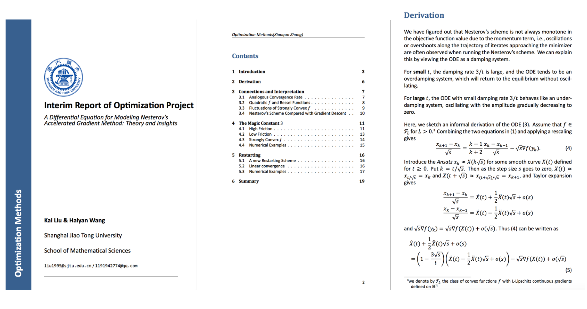
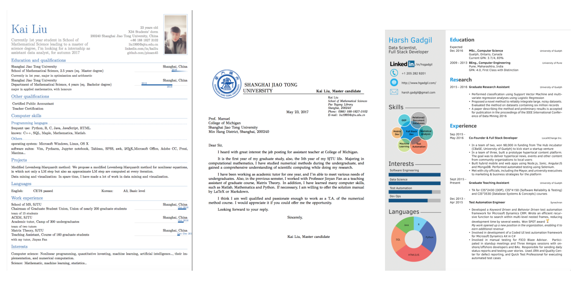
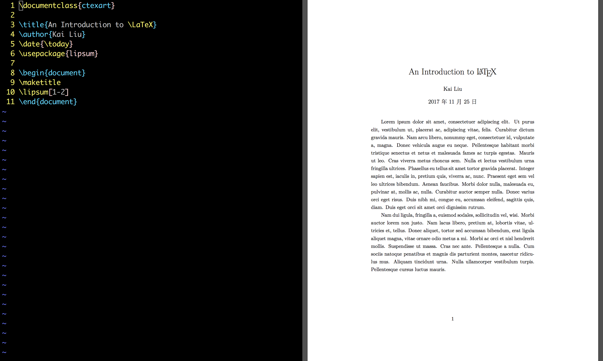

# LaTeX 优雅美观的文档编写

生活中总会有各种各样**文字处理**的需求，尤其在大学校园，很多时候需要提交纸质版电子文档，制作简洁的PPT等。

- 是否羡慕身边那些熟练掌握文字处理技巧和排版技能的同学呢！
- 是否被打印店Office版本不兼容导致内容排布错乱弄得直呼心累！！
- 是否被课程大作业、毕业论文中Word分节、各种格式难调搞得焦头烂额！！！

不用羡慕，不必烦躁，因为我们有更加优雅高效的解决方案！—— LaTeX

实际上，LaTeX 离我们并不遥远。大学课本上长串的数学公式、化学方程式、电路控制图，Springer等各大出版社的论文等等，都离不开 LaTeX 的排版支持。利用 LaTeX，想写出精致的文稿其实很简单！

## 我是谁

一个Office菜鸟，自称二流Excel水平，三流Word水平，却又不愿向巨硬低头的研究生。利用 LaTeX 编写各类文档已有一年经验，包括但不限于：课程笔记/作业、个人简历、LaTeX幻灯片、LaTeX策划书、LaTeX海报、LaTeX申请信等。

## 写在前面的话

LaTeX 是Linux时代的产物，相比Word*所见即所得*的易用特点，LaTeX是一个严格意义上的文字排版语言。它严谨而优美，适用于**多平台**的写作。用户可以在没有任何排版和程序设计基础的情况下，充分发挥 TeX 的强大功能，通过简单的学习就能在==几天==，==甚至几小时==内生成具有**出版社水平**的印刷品。更加重要的一点是，在文档复杂程度和规模体量变大时，LaTeX 依旧可以保证高效率的文稿产出！这不禁让我感叹，既生 LaTeX 何需 Word？

## 安装 LaTeX

说了这么多，到底怎么安装 LaTeX 呢？

- Windows 和 Linux 用户可在[交大葡萄](https://pt.sjtu.edu.cn/details.php?id=144955)站点搜索TeXLive，下载2017发行版
- Mac 用户请选择 MacTeX，同样可在[交大葡萄](https://pt.sjtu.edu.cn/details.php?id=144956)找到。

由于安装包较大，网速受限的同学可以点击关注[**交大数院研究生会**](https://mp.weixin.qq.com/mp/getmasssendmsg?__biz=MzI4Mzk2MzQyOA==#wechat_webview_type=1&wechat_redirect), 后台回复 LaTeX，即可获得转存网盘链接。

## 你将从这里看到

0. LaTeX 的多种用途：写文章、做简历、幻灯片等等。
1. 一个 LaTeX 文档从编辑到发布的全过程
2. 以 LaTeX 的思维组织你的文章结构
3. 利用 LaTeX 进行强有力的数学公式排版
4. 在 LaTeX 文档中插入精美的图片/表格
5. 如何自动化设置页眉页脚等版式
6. LaTeX 语法特点和问题处理

## 活动安排

此次活动主要介绍 LaTeX 从0到1的应用。时间定于本周三 **11月29日晚 7：30-9：00**，地点在**数学系大会议室**。

现场为各位同学准备了茶点零食，**前三十位**到场的同学还将获得由 LaTeX 制作的精美入门教程。

后续活动消息敬请关注[**交大数学研究生会**](https://mp.weixin.qq.com/mp/getmasssendmsg?__biz=MzI4Mzk2MzQyOA==#wechat_webview_type=1&wechat_redirect)

